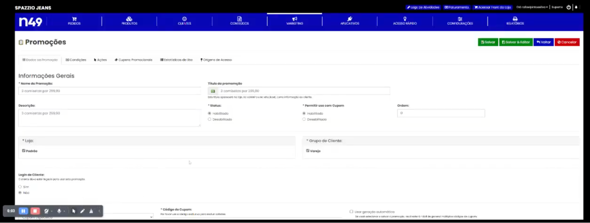

# Seção: Módulo de Promoções

## Descrição

**O que a seção pretende realizar? Quais problemas ou necessidades ela atende?**

Módulo de promoção da plataforma N49Shop que permite ao cliente criar promoções de produtos, categorias, fretes e outros itens de forma avançada.

**Quem são os usuários principais desta seção? Como eles interagem com ela?**

Usuários de clientes e administradores da N49 podem configurar o módulo.

**Como a seção se relaciona com outras partes do sistema ou sistemas externos (integrações)?**

As promoções criadas refletem em comportamentos...

-----

## Funcionalidades

### Exemplos de promoções:

  * **Promoção de X itens por R$Y**

      * **Link do vídeo com explicação da configuração no Admin:** [N49Shop Modulo Promocao - X itens por R$Y.webm](https://www.google.com/search?q=N49Shop%2520Modulo%2520Promocao%2520-%2520X%2520itens%2520por%2520R%24Y.webm)

      * **Contexto de exemplo:** Para cada múltiplo de 3, o cliente precisa alterar a quantidade para 6 e mudar o valor para R$599,80 e assim repetir para novas promoções.

-----

## Layout da Seção

-----

## Referências

  * **Link do módulo:** [https://[dominio\_cliente].gerenciador.n49shop.com.br/admin/index.php?route=sale/special\_promotions](https://www.google.com/search?q=https://%5Bdominio_cliente%5D.gerenciador.n49shop.com.br/admin/index.php%3Froute%3Dsale/special_promotions)