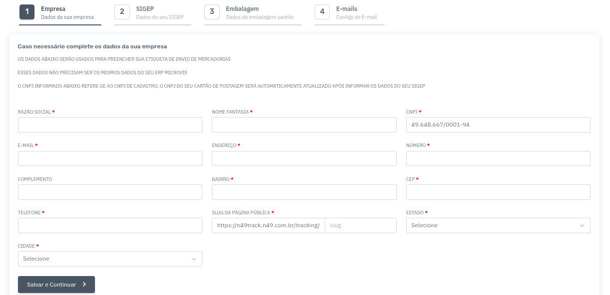
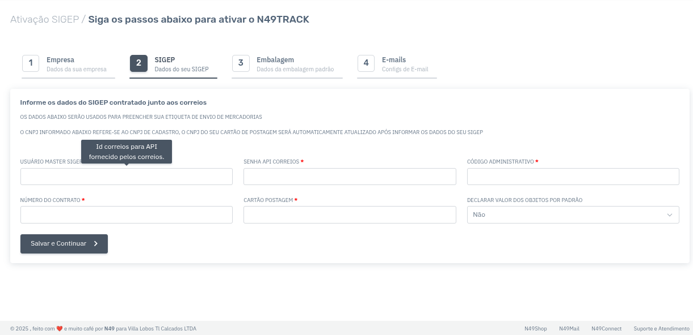
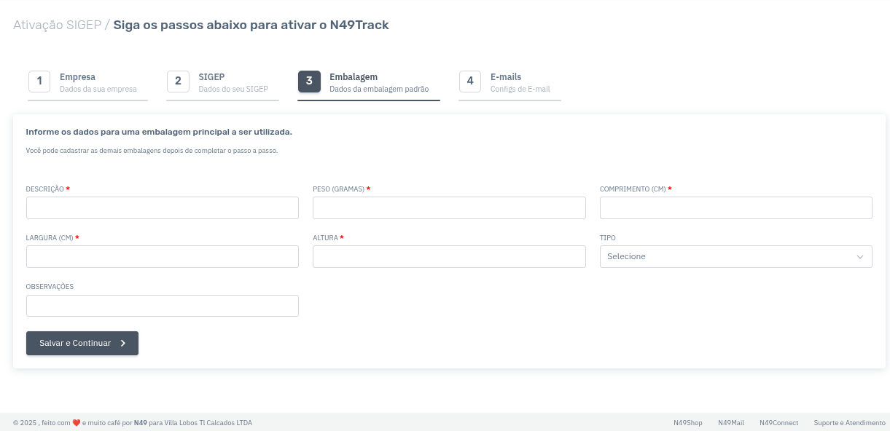
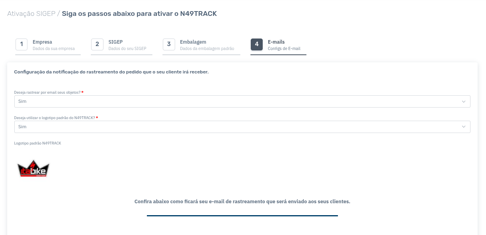

# Seção: Onboarding de cliente Linx

Ao logar pela microvix, existe um cadastro passo a passo, onde o sistema sempre irá redirecionar caso identifique que não existem tais informações necessárias para iniciar a utilização do sistema.

## **Etapa 1: Dados da empresa**

Conforme a imagem abaixo, esta etapa serve apenas para o preenchimento dos dados da empresa que está se cadastrando no N49Track.

No formulário, é possível visualizar o campo **“slug”**, que será utilizado para gerar a URL pública da empresa, onde os clientes finais podem acompanhar seus rastreamentos.

## **Etapa 2: Correios**

A imagem abaixo representa os dados exigidos pelos Correios:

- **Usuário master**: ID da empresa junto aos Correios, visível no sistema MeusCorreios.

- **Senha API Correios**: Geralmente está com o responsável pelo contrato ou no painel do e-commerce.

⚠️ **Atenção**: Não gere uma nova senha nos Correios, pois isso irá invalidar qualquer outro sistema que utilize a senha atual.

- **Código administrativo, número do contrato e cartão de postagem**: Também disponíveis no MeusCorreios.

## Etapa 3: Embalagem

Etapa simples, onde só irá cadastrar os dados de dimensão e tipos de uma caixa padrão da empresa, caso o cliente não queira colocar algo aqui, pode informar apenas 1 e todos os campos\

## **Etapa 4: E-mails**

Nessa etapa, é possível alterar a logo da empresa (caso o cliente deseje) e configurar se os e-mails automáticos de movimentação do rastreio devem ser enviados aos clientes finais.

###
